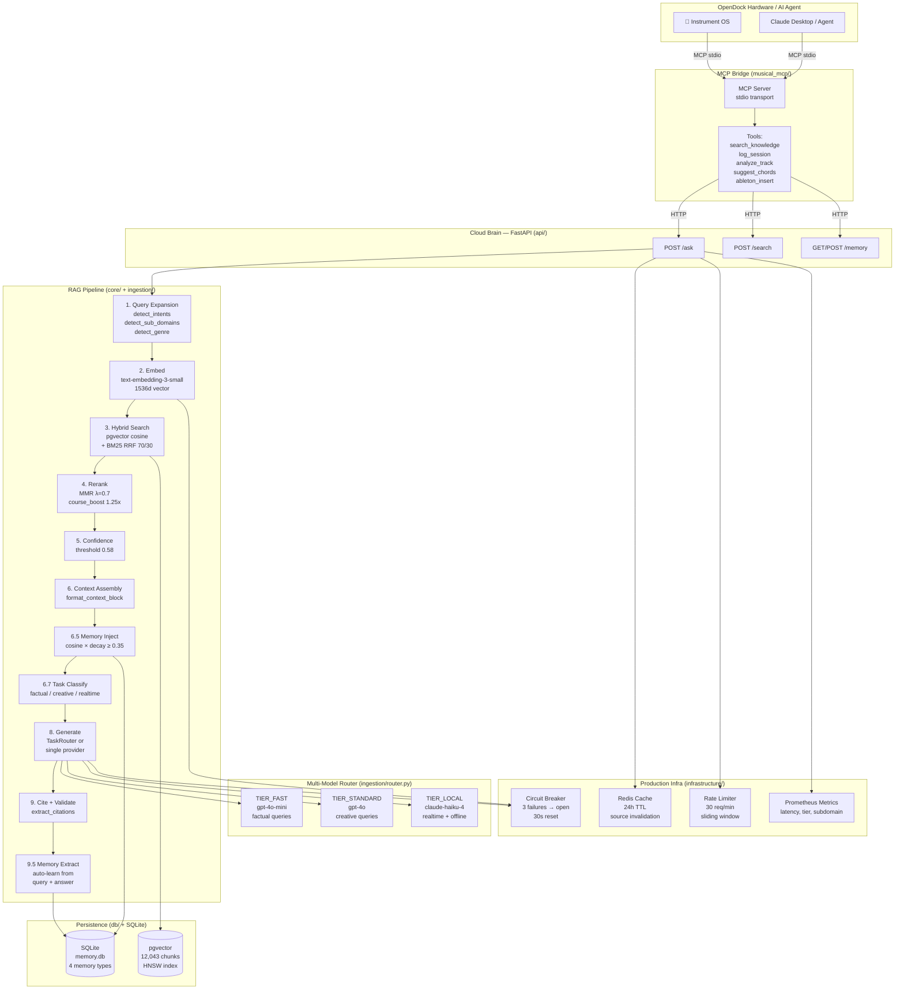
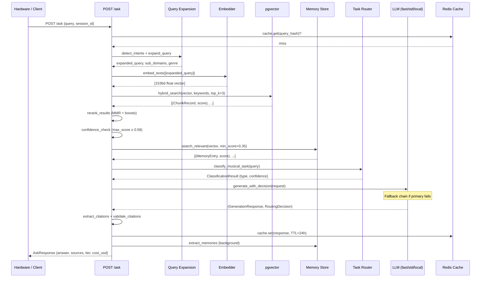
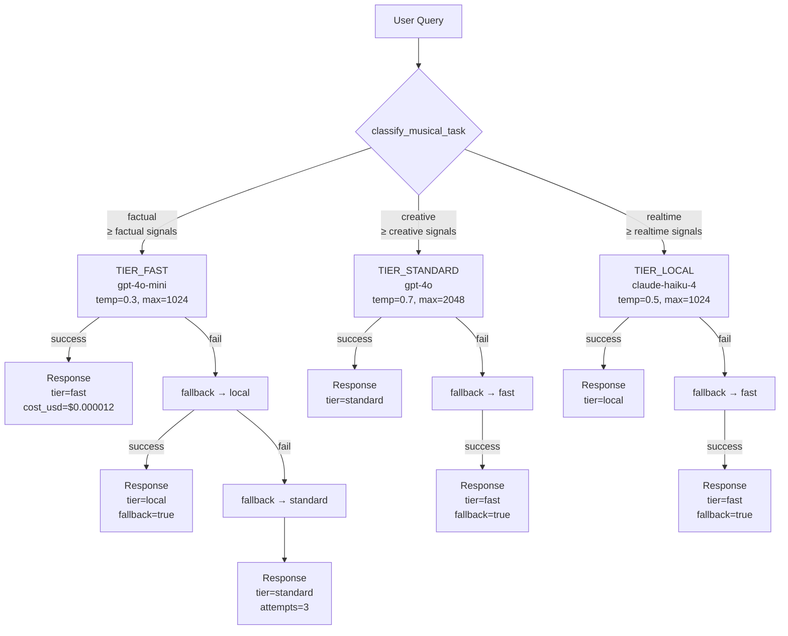
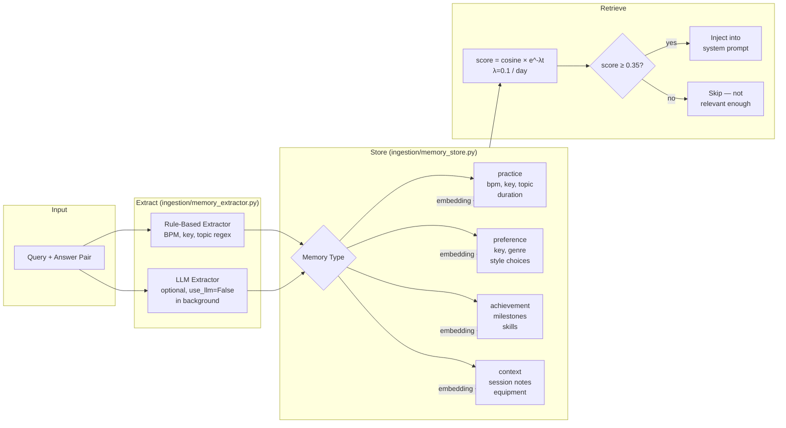
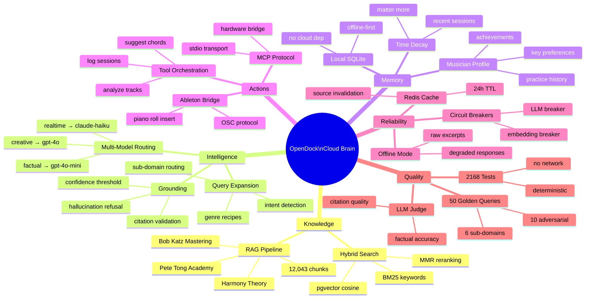

# Architecture Diagram — Musical Intelligence Platform

Visual overview of the system. Paste the Mermaid code blocks into any Mermaid renderer
(mermaid.live, GitHub, Notion, VS Code with Mermaid extension).

---

## 1. Full System — OpenDock Convergence

---

## 2. /ask Request — Data Flow (Sequence)

---

## 3. Multi-Model Routing — Decision Tree

---

## 4. Memory System — Lifecycle

---

## 5. OpenDock Convergence Map

