# Architecture Diagram — Musical Intelligence Platform

Visual overview of the system. Paste the Mermaid code blocks into any Mermaid renderer
(mermaid.live, GitHub, Notion, VS Code with Mermaid extension).

---

## 1. Full System — OpenDock Convergence

```mermaid
graph TB
    subgraph HW["OpenDock Hardware / AI Agent"]
        INST[🎹 Instrument OS]
        CLAUDE[Claude Desktop / Agent]
    end

    subgraph MCP["MCP Bridge (musical_mcp/)"]
        SRV[MCP Server\nstdio transport]
        TOOLS[Tools:\nsearch_knowledge\nlog_session\nanalyze_track\nsuggest_chords\nableton_insert]
    end

    subgraph API["Cloud Brain — FastAPI (api/)"]
        ASK[POST /ask]
        SEARCH[POST /search]
        MEMORY_API[GET/POST /memory]
    end

    subgraph PIPE["RAG Pipeline (core/ + ingestion/)"]
        EXP[1. Query Expansion\ndetect_intents\ndetect_sub_domains\ndetect_genre]
        EMB[2. Embed\ntext-embedding-3-small\n1536d vector]
        VEC[3. Hybrid Search\npgvector cosine\n+ BM25 RRF 70/30]
        RANK[4. Rerank\nMMR λ=0.7\ncourse_boost 1.25x]
        CONF[5. Confidence\nthreshold 0.58]
        CTX[6. Context Assembly\nformat_context_block]
        MEM[6.5 Memory Inject\ncosine × decay ≥ 0.35]
        ROUTE[6.7 Task Classify\nfactual / creative / realtime]
        GEN[8. Generate\nTaskRouter or\nsingle provider]
        CITE[9. Cite + Validate\nextract_citations]
        MEMX[9.5 Memory Extract\nauto-learn from\nquery + answer]
    end

    subgraph TIERS["Multi-Model Router (ingestion/router.py)"]
        T1[TIER_FAST\ngpt-4o-mini\nfactual queries]
        T2[TIER_STANDARD\ngpt-4o\ncreative queries]
        T3[TIER_LOCAL\nclaude-haiku-4\nrealtime + offline]
    end

    subgraph DB["Persistence (db/ + SQLite)"]
        PG[(pgvector\n12,043 chunks\nHNSW index)]
        SQ[(SQLite\nmemory.db\n4 memory types)]
    end

    subgraph INFRA["Production Infra (infrastructure/)"]
        CB[Circuit Breaker\n3 failures → open\n30s reset]
        CACHE[Redis Cache\n24h TTL\nsource invalidation]
        RL[Rate Limiter\n30 req/min\nsliding window]
        PROM[Prometheus Metrics\nlatency, tier, subdomain]
    end

    INST -->|MCP stdio| SRV
    CLAUDE -->|MCP stdio| SRV
    SRV --> TOOLS
    TOOLS -->|HTTP| ASK
    TOOLS -->|HTTP| SEARCH
    TOOLS -->|HTTP| MEMORY_API

    ASK --> EXP
    EXP --> EMB
    EMB --> VEC
    VEC --> RANK
    RANK --> CONF
    CONF --> CTX
    CTX --> MEM
    MEM --> ROUTE
    ROUTE --> GEN
    GEN --> CITE
    CITE --> MEMX

    GEN --> T1
    GEN --> T2
    GEN --> T3

    VEC --> PG
    MEM --> SQ
    MEMX --> SQ

    EMB --> CB
    GEN --> CB
    ASK --> CACHE
    ASK --> RL
    ASK --> PROM
```

---

## 2. /ask Request — Data Flow (Sequence)

```mermaid
sequenceDiagram
    participant HW as Hardware / Client
    participant API as POST /ask
    participant EXP as Query Expansion
    participant EMB as Embedder
    participant DB as pgvector
    participant MEM as Memory Store
    participant ROUTE as Task Router
    participant LLM as LLM (fast/std/local)
    participant CACHE as Redis Cache

    HW->>API: POST /ask {query, session_id}
    API->>CACHE: cache.get(query_hash)?
    CACHE-->>API: miss

    API->>EXP: detect_intents + expand_query
    EXP-->>API: expanded_query, sub_domains, genre

    API->>EMB: embed_texts([expanded_query])
    EMB-->>API: [1536d float vector]

    API->>DB: hybrid_search(vector, keywords, top_k×3)
    DB-->>API: [(ChunkRecord, score), ...]

    API->>API: rerank_results (MMR + boosts)
    API->>API: confidence_check (max_score ≥ 0.58)

    API->>MEM: search_relevant(vector, min_score=0.35)
    MEM-->>API: [(MemoryEntry, score), ...]

    API->>ROUTE: classify_musical_task(query)
    ROUTE-->>API: ClassificationResult {type, confidence}

    API->>LLM: generate_with_decision(request)
    Note over LLM: Fallback chain if primary fails
    LLM-->>API: (GenerationResponse, RoutingDecision)

    API->>API: extract_citations + validate_citations
    API->>CACHE: cache.set(response, TTL=24h)
    API->>MEM: extract_memories (background)

    API-->>HW: AskResponse {answer, sources, tier, cost_usd}
```

---

## 3. Multi-Model Routing — Decision Tree

---

## 4. Memory System — Lifecycle

---

## 5. OpenDock Convergence Map

```mermaid
mindmap
  root((OpenDock\nCloud Brain))
    Knowledge
      RAG Pipeline
        12,043 chunks
        Pete Tong Academy
        Bob Katz Mastering
        Harmony Theory
      Hybrid Search
        pgvector cosine
        BM25 keywords
        MMR reranking
    Intelligence
      Multi-Model Routing
        factual → gpt-4o-mini
        creative → gpt-4o
        realtime → claude-haiku
      Query Expansion
        intent detection
        sub-domain routing
        genre recipes
      Grounding
        citation validation
        confidence threshold
        hallucination refusal
    Memory
      Musician Profile
        practice history
        key preferences
        achievements
      Time Decay
        recent sessions
        matter more
      Local SQLite
        offline-first
        no cloud dep
    Actions
      Tool Orchestration
        log sessions
        analyze tracks
        suggest chords
      Ableton Bridge
        OSC protocol
        piano roll insert
      MCP Protocol
        stdio transport
        hardware bridge
    Reliability
      Circuit Breakers
        LLM breaker
        embedding breaker
      Offline Mode
        degraded responses
        raw excerpts
      Redis Cache
        24h TTL
        source invalidation
    Quality
      50 Golden Queries
        6 sub-domains
        10 adversarial
      LLM Judge
        factual accuracy
        citation quality
      2168 Tests
        no network
        deterministic
```

